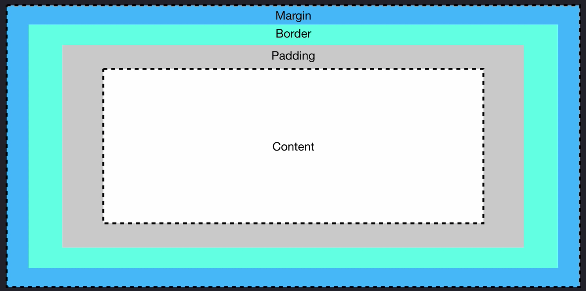

+++
title = "The Box Model"

date = 2020-10-14T00:00:00
lastmod = 2020-10-14T00:00:00
draft = false
reading_time = false
authors = ["Michael W. Brady"]
+++

A pattern for positioning HTML elements on the page using CSS

- Content: The space within the model in which our text and images are rendered
- Padding: The spacing between the content and border
- Border: A border that we can style around the padding and content of a box
- Margin: The space between the border and everything else on the page

Shorthand specifications is top-right-bottom-left

`padding: 20px 20px 20px 20px;`

`Margin:auto` — horizontally centers the element in its container

`box-sizing: border-box;` — attribute that makes padding work from within the width/height specifications versus adding to the overall width/height of the content.

## Display Property

`display: none;` — Used to temporarily hide content. Removes the element from the document. Not to be confused with `visibility: hidden` which only hides the content

`display: inline;` — allows for elements to be nested within other elements without disrupting the flow of content. height, width have no effect. Only takes up as much space as it's content. `block` elements are not to be nested within `inline` elements. Can use text-align to position horizontally and vertical-align to position vertically.

`display: block` — block elements take up as much space as their parent element will allow. If you want to control block elements you need to use height, width properties. You can nest block and inline elements within block elements. Block elements start on a new line. can use margin: auto to center horizontally. Challenging to center vertically.

`display: inline-block` — will have default behavior of inline element with the added bonus of controlling the size using height, width. Inline behavior allows for elements to stack next to each other.
