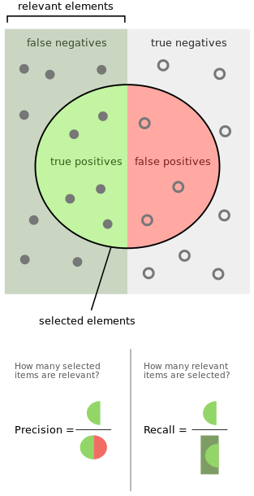
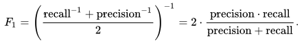
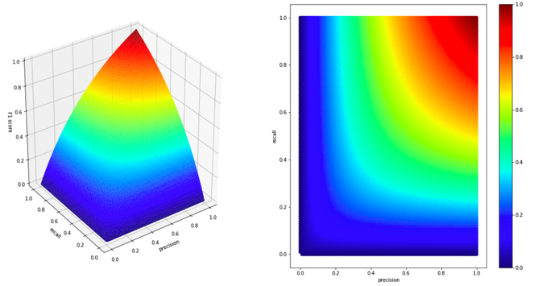
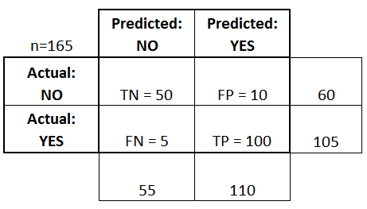
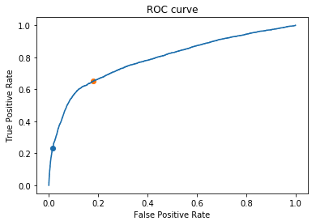
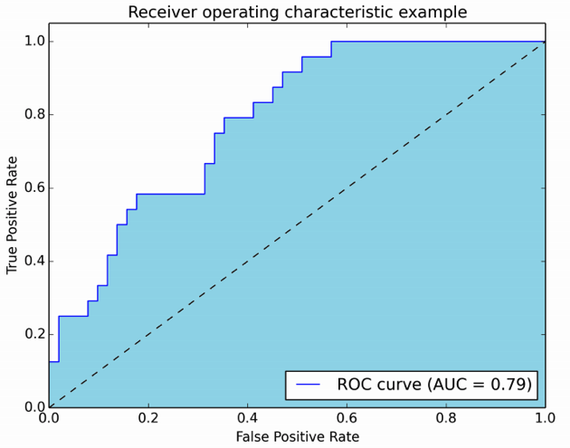

+++
title = "Basic Classification Metrics"

date = 2019-10-22T00:00:00
lastmod = 2019-10-22T00:00:00
draft = false
reading_time = false

# Authors
authors = ["Michael W. Brady"]
+++

## Precision

*How useful are the results?*

Out of the results returned how many are correct? 

A perfectly precise model returns no false positives. Precision is a measure of quality.

`Precision = Correct positive predictions / total positive predictions`

## Recall

*How complete are the results?*

Out of all the correct results how many were returned? 

A model with perfect recall has no false negatives. Recall is a measure of of completeness of quantity

`Recall = Correct positive predictions / total positive observations in dataset`

[Source: Wikipedia](https://en.wikipedia.org/wiki/Precision_and_recall)

## F1 Score

The harmonic average of precision and recall:

[Wikipedia](https://en.wikipedia.org/wiki/F1_score)

    # By Hand
    f1 = 2 * precision * recall / (precision + recall)
    
    # With Sklearn
    from sklearn.metrics import f1_score
    
    f1_score(y_true, y_pred)

Since the F1 Score uses the harmonic mean, it emphasizes the lowest value. As seen in the chart below, low precision or low accuracy values will dramatically lower an F1 score: 

[Source: Bartosz Mikulski](https://mikulskibartosz.name/f1-score-explained-d94ee90dec5b)

Thus, an F1 score is well suited for scoring classification models. A naive classifier (guessing majority class) will have a recall of 1 but precision near zero, thus the F1 score will be near zero. 

The f1 Score is bounded from 0 to 1 (1 = perfect recall and precision). To investigate why a model has a low F1 score it is helpful to study the confusion matrix.

### Generate a Classification Report

Sklearn's classification report function summarizes the main classification metrics: 

    from sklearn.metrics import classification_report
    
    print(classification_report(y_true, y_pred)

## Confusion Matrix

A table used to describe the performance of a classification model. 

[DataSchool](https://www.dataschool.io/simple-guide-to-confusion-matrix-terminology/)

- True Positives: Model correctly predicted 'YES'
- False Positive: Model incorrectly predicted 'YES'
- True Negative: Model correctly predicted 'NO'
- False Negative: Model incorrectly predicted 'NO'

    from sklearn.metrics import confusion_matrix
    
    conf_mat pd.DataFrame(confusion_matrix(y_train, y_pred), 
                 columns=['Predicted Negative', 'Predicted Positive'], 
                 index=['Actual Negative', 'Actual Positive'])
    
    print(conf_mat)

## ROC (Receiver Operating Characteristic) Curve

*"Graph that summarizes the performance of a classifier over all possible thresholds. It is generated by plotting the True Positive Rate (y-axis) against the False Positive Rate (x-axis) as you vary the threshold for assigning observations to a given class" ([Data School](https://www.dataschool.io/simple-guide-to-confusion-matrix-terminology/)).*

The ROC curve is found by calculating the false positive and false negative rates for a classification model at various probability threshold levels. 

    from sklearn.metrics import roc_auc_score, roc_curve
    fpr, tpr, thresholds = roc_curve(y_train, y_pred_proba)
    plt.plot(fpr, tpr)
    plt.title('ROC curve')
    plt.xlabel('False Positive Rate')
    plt.ylabel('True Positive Rate')
    print('Area under the Receiver Operating Characteristic curve:', 
          roc_auc_score(y_train, y_pred_proba))

Higher AUC scores will have ROC curves that hug the top left corner of the chart. Low AUC scores will be close to a diagonal line across the plot. 

### ROC AUC Score

ROC AUC is the area under the ROC curve. ROC AUC measures how well a classifier ranks predicted probabilities. 

Scores range from 0 to 1. A naive majority class baseline will have a ROC AUC score of 0.5

[Stats Exchange](https://stats.stackexchange.com/questions/132777/what-does-auc-stand-for-and-what-is-it)

ROC AUC scores are also good for imbalanced categories as it looks at rank order.

AUC stands for area under the curve.

    from sklearn.metrics import roc_auc_score
    
    y_pred_proba = model.predict_proba(X_test)[:,1]
    
    print('Test ROC AUC Score:', roc_auc_score(y_test, y_pred_proba))

## Framing output in terms of business impact

[Jupyter Notebook Viewer](https://nbviewer.jupyter.org/github/podopie/DAT18NYC/blob/master/classes/13-expected_value_cost_benefit_analysis.ipynb)

[Visualizing Machine Learning Thresholds to Make Better Business Decisions](https://blog.insightdatascience.com/visualizing-machine-learning-thresholds-to-make-better-business-decisions-4ab07f823415?gi=1f5287256598)