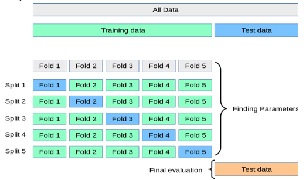

+++
title = "Cross-Validation"

date = 2019-10-22T00:00:00
lastmod = 2019-10-22T00:00:00
draft = false
reading_time = false
authors = ["Michael W. Brady"]
+++
A technique where you repeatedly rebuild your model based on differing combinations of train and test data. Then accuracy scores can be averaged across tests. 

A primary reason that cross-validation is more robust than a simple train-test split is it guards against unrepresentative splits (e.g., splits that are not representative of dataset).

Cross-validation eliminates the need for a validation set and allows for parameter optimization without creating leakage from the test data. A test set still needs to be created and tested separately during final evaluation. 

Source: [Sklearn Documentation](https://scikit-learn.org/stable/modules/cross_validation.html)

### 10-Fold Cross Validation

A common method which divides a dataset into 10 random, but equal, parts. 9 of the ten buckets are used to train and the tenth is used for testing. This process than repeats ten times each time using a different bucket for testing.

From [A Guide to Data Mining](http://guidetodatamining.com/assets/guideChapters/DataMining-ch5.pdf): 

1. Equally divide the data into 10 buckets
2. Iterate through the possible combinations of train and test splits
3. Sum up the results 

    from sklearn.model_selection import cross_val_score
    
    scores = cross_val_score(logreg, X_train_imputed, y_train, cv=10)
    print( scores.min(), scores.mean(), scores.max() )
    print(scores)

The cross_validate method allows for multiple scoring metrics to be returned at once (as two dimensional array):

    from sklearn.model_selection import cross_validate
    
    scoring = ['f1', 'roc_auc', 'accuracy']
    scores = cross_validate(model, X_train, y_train, scoring=scoring, cv=5)
    scores = pd.DataFrame(scores)
    scores.describe()

To view a list of all potential scoring options, use: 

    import sklearn
    sorted(sklearn.metrics.SCORERS.keys())

### Leave One Out

n-fold cross validation (where n is number of observations in dataset). 

The advantage of n-fold cross validation is that the training data is maximized and it is deterministic (results will not vary if re-run). The disadvantage is that it is extremely computationally intensive. 

### Stratification

Refers to the process of dividing datasets into subgroups that are representative of the dataset (e.g., each subgroup contains both men and women not just men)

### Determinitistic

A model or process which will always produce the same output given the same input. No randomness is involved in the process/model

## Validation Curve

Determine the training and test scores for varying hyperparameter values (similar to grid search with just a single parameter). 

    import numpy as np
    from sklearn.model_selection import validation_curve
    
    model = RandomForestRegressor(n_estimators=100)
    
    depth = [2, 3, 4, 5, 6]
    train_score, val_score = validation_curve(
        model, X_train, y_train,
        param_name='max_depth', param_range=depth, 
        scoring='neg_mean_absolute_error', cv=3)
    
    plt.plot(depth, np.median(train_score, 1), color='blue', label='training score')
    plt.plot(depth, np.median(val_score, 1), color='red', label='validation score')
    plt.legend(loc='best')
    plt.xlabel('depth');