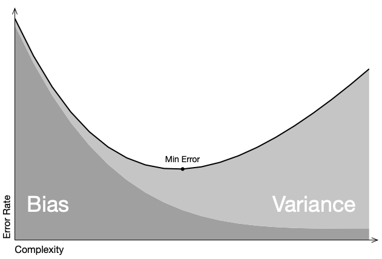

+++
title = "Decision Trees"

date = 2019-10-22T00:00:00
lastmod = 2019-10-22T00:00:00
draft = false
reading_time = false
authors = ["Michael W. Brady"]
+++
Decision trees excel at capturing interactions between features.

### Implementing a simple Decision Tree Regressor

    from sklearn.tree import DecisionTreeRegressor
    import pandas as pd
    
    house_X = house.drop(columns='Price')
    house_y = house['Price']
    
    tree = DecisionTreeRegressor()
    tree.fit(house_X, house_y)
    print('R^2', tree.score(house_X, house_y))

### Visualizing Trees

A simple way to visualize trees (becomes less manageable as max_depth increases): 

    import graphviz
    from sklearn.tree import DecisionTreeClassifier, DecisionTreeRegressor, export_graphviz
    
    def viztree(decision_tree, feature_names):
        """Visualize a decision tree"""
        dot_data = export_graphviz(decision_tree, out_file=None, feature_names=feature_names, 
                                   filled=True, rounded=True)   
        return graphviz.Source(dot_data)

### Implementing a DecisionTreeClassifier()

    from sklearn.tree import DecisionTreeClassifier
    tree = DecisionTreeClassifier(max_depth=4)
    tree.fit(X, y)
    print('R^2', tree.score(X, y))

Compare to a logistic regression

    from sklearn.linear_model import LogisticRegression
    from sklearn.metrics import r2_score
    
    model = LogisticRegression(solver='lbfgs')
    model.fit(X, y)
    y_pred = model.predict(X)
    print('R^2', r2_score(y, y_pred))

### Bias and Variance

Overall model error is a function of error due to bias plus error due to variance. The ideal model minimizes error from each.

- Bias is the difference between the average prediction of our model and the actual target value. Models with high bias are under fit, low bias models may be overfit.
- Variance is the variability of model prediction for a given data point or a value. Models with high variance may do well on test data but fail to generalize.

[A visual introduction to machine learning, Part II](http://www.r2d3.us/visual-intro-to-machine-learning-part-2/)