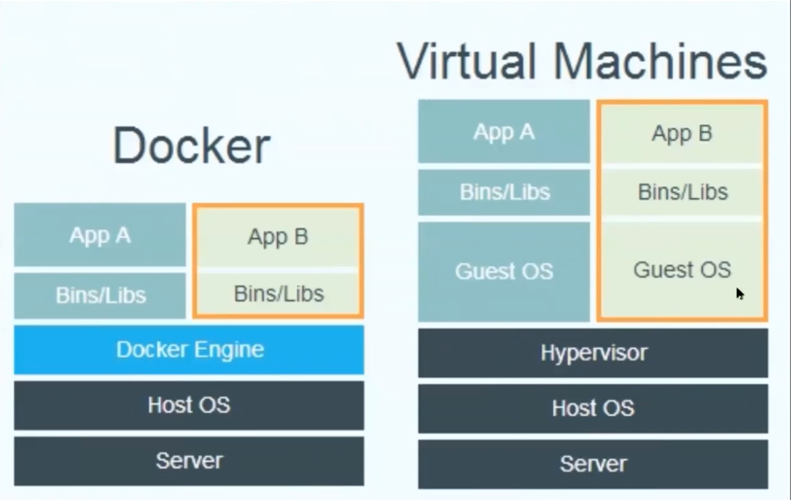

+++
title = "Docker"

date = 2019-10-22T00:00:00
lastmod = 2019-10-22T00:00:00
draft = false
reading_time = false

# Authors
authors = ["Michael W. Brady"]
+++

Tradeoff between lightweight and security (quality of sandboxing). 

Docker firing up a single container with stuff in it. Main use case is develop locally but ensure deploy environment is the same. 

Kubernetes is a way to deploy containers to thousands of servers. 

The image is the underlying information (the disk). 

Each run of a container gives you a 'fresh' start. 

### Command Line Shortcuts

    # List all images on computer
    docker image ls
    
    # List all containers
    docker container ls -a
    
    # Run Debian image which produces a container
    docker run debian -it /bin/bash
    
    # Install python in container
    apt update 
    apt install python3-pip
    
    # Exit container
    exit
    
    # Remove all stopped containers
    Docker container prune

### # Example Dockerfile

    FROM debian
    
    # Comments are like this 
    # So logging works w/Docker
    ENV PYTHONUNBUFFERED=1 
    
    # You can RUN things, mostly to install dependencies
    # -y says 'yes' automatically to command line prompts if we want to install something
    RUN apt-get update && apt-get upgrade -y && \
        apt-get install python3-pip python-pandas -y && \
        pip3 install -i https://test.pypi.org/simple/ data-explorer && \ 
        python3 -c "import data-explorer"

Note the dockerfile must be saved as 'Dockerfile' no file extension, case sensitive

    # Requires a docker file to be created 
    docker build . -t python

After successful build, we can launch the image with the following commands

    docker run -it python /bin/bash
    
    # enter python shell
    python3
    
    # import module
    from Data_Explorer.explorer import explorer

## Docker CL Commands

    ## List Docker CLI commands
    docker
    docker container --help
    
    ## Display Docker version and info
    docker --version
    docker version
    docker info
    
    ## Execute Docker image
    docker run hello-world
    
    ## List Docker images
    docker image ls
    
    ## List Docker containers (running, all, all in quiet mode)
    docker container ls
    docker container ls --all
    docker container ls -aq

[Get Started, Part 1: Orientation and setup](https://docs.docker.com/get-started/)