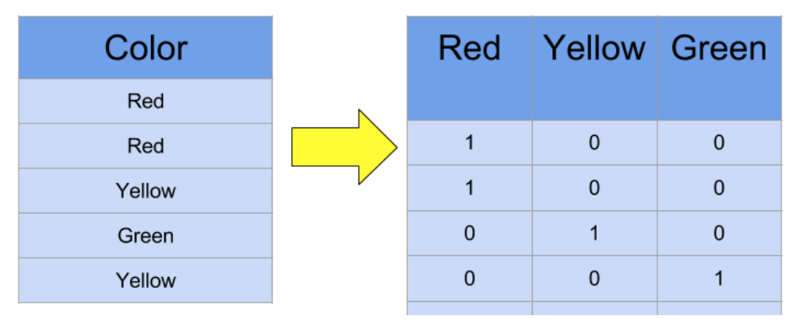

+++
title = "Approaches to encoding categorical data"

date = 2019-10-22T00:00:00
lastmod = 2019-10-22T00:00:00
draft = false
reading_time = false

# Authors
authors = ["Michael W. Brady"]
+++
The goal of encoding categorical features is to allow predictive models to accept the features as inputs. The most popular route to encoding data is one hot encoding. If a categorical feature has >15 different values, one hot encoding may not be the best approach. 

### Cardinality:

Cardinality means the number of unique values that a feature has.

Consider reducing high cardinality by grouping low frequency categories into 'other'

### **One hot encoding:**

One hot encoding creates new binary columns indicating the presence of each possible value from the original data. One hot encoding creates one column per category. 

The primary issue with one hot encoding is that it can explode the dimensionality (# of columns) of a dataset. This can be corrected for using dimensionality reduction techniques like PCA if necessary. 


```
    one_hot_encoded_training_predictors = pd.get_dummies(train_predictors)
```
One hot encoding with category encoders: 
```
    import category_encoders as ce
    
    features = ['','']
    X_train = X_train[features]
    
    encoder = ce.OneHotEncoder(use_cat_names=True)
    
    X_train_encoded = encoder.fit_transform(X_train)
    X_test_encoded  = encoder.transform(X_test)
```


### Ordinal (Label):

Each label is assigned a unique number which represents it. **Ordinal encoding implies an ordering to the data which may or may not exist.** **This is acceptable for some model types (e.g., tree based models), but not for most (including regression models).** Ordinal encoding should be used on ordinal data. Ordinal data is categorical data which has an ordering to it (e.g., low / medium / high). 

w/Category Encoders:


With Pandas, convert a column to a category type and use those category values for label encoding:
```
    obj_df["body_style"] = obj_df["body_style"].astype('category')
    obj_df["body_style_cat"] = obj_df["body_style"].cat.codes
```
Source: [PBP Python](https://pbpython.com/categorical-encoding.html)

**Note: Be sure to align columns across datasets (e.g., train and test)**

Scikit-learn is sensitive to the ordering of columns, so if the training dataset and test datasets get misaligned, your results will be nonsense. This could happen if a categorical had a different number of values in the training data vs the test data.
```
    train_dummies = pd.get_dummies(train)
    test_dummies = pd.get_dummies(test)
    train, test = train_dummies.align(test_dummies, join='left', axis=1)
```
Source: 

[Using Categorical Data with One Hot Encoding](https://www.kaggle.com/dansbecker/using-categorical-data-with-one-hot-encoding)

### Hashing

Hashing is similiar to one-hot encoding but with fewer dimensions and potential overlap resulting in information loss. 


Source: [TDS](https://towardsdatascience.com/smarter-ways-to-encode-categorical-data-for-machine-learning-part-1-of-3-6dca2f71b159)

### Binary

Binary is a hybrid of one-hot and hashing. Essentially binary encoders convert each category to ordinal numeric values and then to binary code. Finally, the binary code is split across separate columns. 


Typically it makes sense just to use a hashing encoder. 

[Category Encoders - Category Encoders latest documentation](http://contrib.scikit-learn.org/categorical-encoding/)

### Target Encoding

Target encoders consider the correlation between the individual categories and the target. The category encoder's target encoding by default looks at the relationship between each category and the mean of the target. 

Data leakage and overfitting are a major concern when using target encoding. 

Two properties to reduce over-fitting are:

1. **Smoothing** (weights an individual category's mean with the overall categorical variable
2. m**in_samples_leaf**, specifies the minimum number of samples within a category in order for the encoder to take the category mean into account. 
```
    from category_encoders import TargetEncoder
    
    targ_enc = TargetEncoder(cols=columns, smoothing=8, min_samples_leaf=5)
```
### Weight of Evidence

'Weight of evidence (WOE) encoder calculates the natural log of the % of non-events divided by the % of events for each category within a categorical feature. For clarification, the events are referring to the target variable.'
```
    from category_encoders import WOEEncoder
    
    woe_enc = WOEEncoder(cols=columns, random_state=17)
```
### Get count of unique values in all non-numeric columns
```
    df.select_dtypes(exclude='number').apply(pd.Series.nunique, axis = 0)
```
### Function to encode binary columns:
```
    binary_columns = ['intl_plan', 'vmail_plan', 'churn'] 
    for col in binary_columns: 
        df[col] = df[col].map({ 
            'no': 0
        ,   'False.': 0
        ,   'yes': 1
        ,   'True.': 1 
        })
```
Convert columns with a high percent of missing values to binary columns (indicating whether the value is missing or not):
```
    for col in many_nulls:
    	X[col] = X[col].isnull()
```