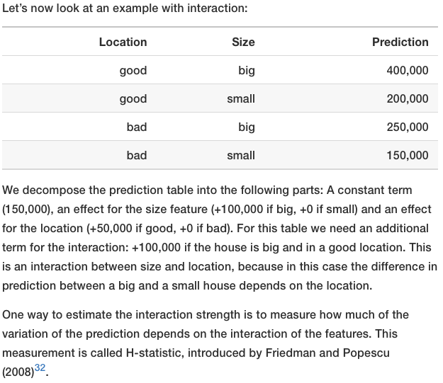
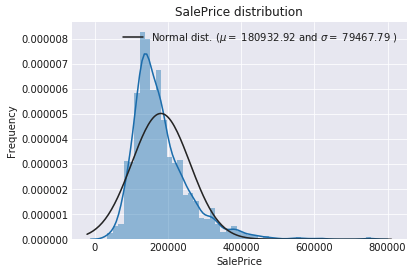

+++
title = "Feature Engineering"

date = 2019-10-22T00:00:00
lastmod = 2019-10-22T00:00:00
draft = false
reading_time = false
authors = ["Michael W. Brady"]
+++
> Feature engineering refers to a geneal process and can involve both feature construction: adding new features from the existing data, and feature selection: choosing only the most important features or other methods of dimensionality reduction. ([Kaggle](https://www.kaggle.com/willkoehrsen/start-here-a-gentle-introduction))

You can drop or scale data points in your training data, **but you can not touch observations in your validation or test data set.** 

### Interaction Effect

Linear regression assumes that variables are independent of each other, but this is rarely the case in the real world. 

Interaction effects occur when the effect of one variable depends on the value of another variable. One way to account for an interaction effect is to create an additional feature to capture the relationship: 

$$satisfaction_i = \beta_0 + \beta_1 food_i + \beta_2condiment_i + \beta_3(food\times condiment_i) + \epsilon$$

A simple example from [Interpretable ML](https://christophm.github.io/interpretable-ml-book/interaction.html): 

One way to measure the interaction effect is to calculate the H-statistic. The H-statistic is defined as the share of variance that is explained by the interaction. The H-statistic is comparable across models and features as it is bounded (0,1).

Interaction effects cannot be precisely modeled by regression models which assume independence. Decision trees excel at modeling 'it depends' relationships

[Understanding Interaction Effects in Statistics - Statistics By Jim](https://statisticsbyjim.com/regression/interaction-effects/)

[Discover Feature Engineering, How to Engineer Features and How to Get Good at It](https://machinelearningmastery.com/discover-feature-engineering-how-to-engineer-features-and-how-to-get-good-at-it/)

## Log Transform Numerical Features

Lessen impact of outliers on features with moderate/high skew. *General rule of thumb, is that > 0.5 is considered at least moderately skewed.* 

    skewness = train_num.apply(lambda x: skew(x))
    skewness = skewness[abs(skewness) > 0.5]
    print(str(skewness.shape[0]) + " skewed numerical features to log transform")
    skewed_features = skewness.index
    train_num[skewed_features] = np.log1p(train_num[skewed_features])

**Plot a potential variable to be transformed against a fitted normal distribution of the variable:**

    sns.distplot(train['SalePrice'] , fit=norm);
    
    # Get the fitted parameters used by the function
    (mu, sigma) = norm.fit(train['SalePrice'])
    
    #Now plot the distribution
    plt.legend(['Normal dist. ($\mu=$ {:.2f} and $\sigma=$ {:.2f} )'.format(mu, sigma)],
                loc='best')
    plt.ylabel('Frequency')
    plt.title('SalePrice distribution')

- **Background on *e* and *ln(e)***

    e is the base rate of growth shared by all continually growing processes (e = ~2.718)

    The natural log of e, *ln(e)*, gives you the time needed to reach a certain level of growth. From Better Explained: 

    - e^x is the amount we have a starting at 1 and growing continuously for x units of time
    - ln(x) is the time to reach amount x, assuming we grew continuously from 1

    [Demystifying the Natural Logarithm (ln)](https://betterexplained.com/articles/demystifying-the-natural-logarithm-ln/)

### Polynomial Features

    train["Feature-s2"] = train["Feature"] ** 2
    train["Feature-s3"] = train["Feature"] ** 3
    train["Feature-Sq"] = np.sqrt(train["Feature"])

With [sklearn's polynomialfeatures](https://scikit-learn.org/stable/modules/generated/sklearn.preprocessing.PolynomialFeatures.html#sklearn.preprocessing.PolynomialFeatures) processing: 

    >>> X = np.arange(6).reshape(3, 2)
    >>> X
    array([[0, 1],
           [2, 3],
           [4, 5]])
    >>> poly = PolynomialFeatures(2)
    >>> poly.fit_transform(X)
    array([[ 1.,  0.,  1.,  0.,  0.,  1.],
           [ 1.,  2.,  3.,  4.,  6.,  9.],
           [ 1.,  4.,  5., 16., 20., 25.]])
    >>> poly = PolynomialFeatures(interaction_only=True)
    >>> poly.fit_transform(X)
    array([[ 1.,  0.,  1.,  0.],
           [ 1.,  2.,  3.,  6.],
           [ 1.,  4.,  5., 20.]])

### Encoding Categorical Features

    df = pd.get_dummies(df)

Note, sklearn requires that the train and test sets columns are perfectly aligned. 

### Tip: Create a make_features function to avoid mistakes when applying features to both test and train

    def make_features(X):
        X = X.copy()
        X['adult_male'] = (X['Sex'] == 'male') & (X['Age'] >= 16)
        X['alone'] = (X['SibSp'] == 0) & (X['Parch'] == 0)
        X['last_name'] = X['Name'].str.split(',').str[0]
        X['title'] = X['Name'].str.split(',').str[1].str.split('.').str[0]
        return X
    
    train = make_features(train)
    test  = make_features(test)

# Automated Feature Engineering

[What is Featuretools? - Featuretools 0.7.1 documentation](https://docs.featuretools.com)