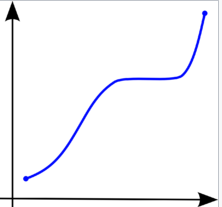

+++
title = "Functions (in linear algebra)"

date = 2019-10-22T00:00:00
lastmod = 2019-10-22T00:00:00
draft = false
reading_time = false
authors = ["Michael W. Brady"]
+++
Functions are a relationship between a set of inputs (domain) and a set of outputs (range) with the property that each input is mapped to exactly one output. 

For example, a two dimension function must pass the vertical line test

Source: [Wikipedia](https://en.wikipedia.org/wiki/Vertical_line_test)

A function is a mathematical object that takes numbers as inputs and produces numbers as outputs. 

- **Domain**: The domain of a function is the set of allowed input values.
- **Range or Image**: set of all possible output values of the function
- **Codomain**: Describes the types of outputs a function has

Functions can map between dimensions (e.g., take 2 inputs, output 3):

$$h(𝑥_1,𝑥_2)=(x_1+x_2,  x_2-x_1,  x_2*x_3)$$

### Monotonic

A relationship that exhibits the following behavior: As the value of one variable increases, so do the other variable. OR (2) the value of one variable increases, the other variable decreases ([Laerd](https://statistics.laerd.com/statistical-guides/spearmans-rank-order-correlation-statistical-guide.php))

- If the relationship between variables inverts at any point then the relationship is not monotonic

Monotonically Increasing Function ([Wikipedia](https://en.wikipedia.org/wiki/Monotonic_function))

Monotonically Decreasing Function ([Wikipedia](https://en.wikipedia.org/wiki/Monotonic_function))

- Accidents per mile driven and age is a classic example of a non-monotonic relationship ([bowl shaped distribution](http://howwedrive.com/2009/02/20/whats-the-real-risk-of-older-drivers/))