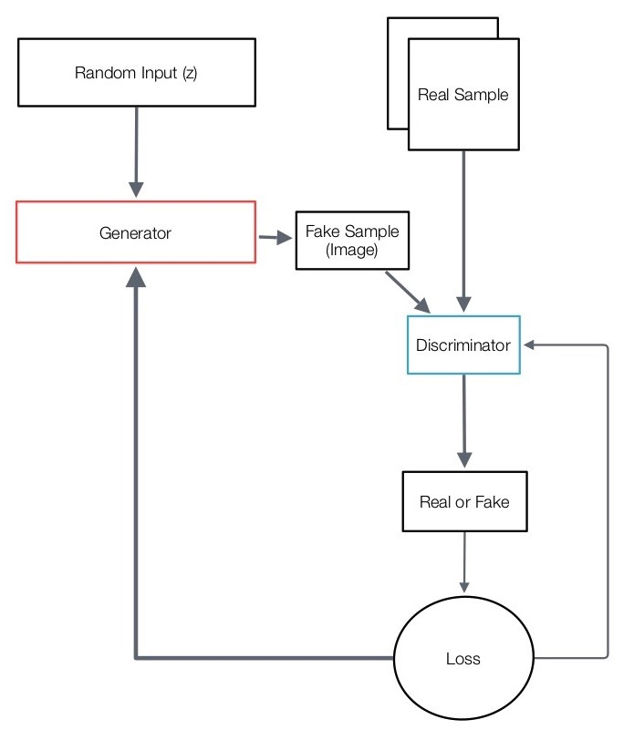

+++
title = "Generative Models"

date = 2019-10-22T00:00:00
lastmod = 2019-10-22T00:00:00
draft = false
reading_time = false

# Authors
authors = ["Michael W. Brady"]
+++
Generative models are trained on a collection of samples drawn from a (typically unknown) distribution with the goal to produce new samples from that probability distribution. 

# Variational Autoencoders

Autoencoders try to make their output equal to their input. Typically the architecture of autoencoders forces the data to go through a bottleneck (e.g., input is 1,000 nodes, but hidden layer is 10 nodes, output layer is 1,000 nodes)

Autoencoders have three distinct parts:

- **The bottleneck** is referred to as the latent space. The latent space is a compressed representation of the samples.
- **The encoder** takes the samples and converts them to compressed representations.
- **The decoder** takes compressed representations in the latent space and converts them back to original samples

A generic autoencoder will often only produce samples from a small part of the latent space. To overcome this, variation is introduced in two ways:

- A loss function is added to force the latent vectors to follow a specific distribution.
- Random noise is added to the latent vectors.

# Generative Adversarial Networks

**Generator:** An algorithm that creates data to try to fake out the discriminator. The generator starts from noise, and tries to generate output to fool the discriminator

**Discriminator:** An algorithm (typically a classifier) which determines if the image is representative of the real sample ("real" or "fake"). The discriminator is trained with real—unlabeled data— and has the goal of identifying whether or not some new item belongs in it

The objective of the discriminator is to be as close to 100% accurate as possible. The objective of the generator is to try and optimize the discriminator toward zero. Thus, GANs can be consider a zero-sum game.

Typically though in a zero-sum game there is something known as a Nash equilibrium. A Nash equilibrium is a stable situation where neither player would want to unilaterally change strategy, but where a superior outcome exists (an outcome both players would prefer to what they have now). 

The key to achieving Nash equilibriums—and overcoming prisoner dilemma's—is iteration.