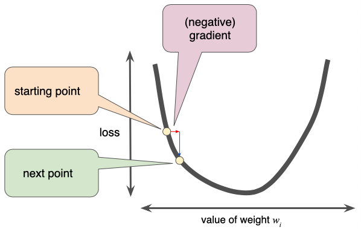

+++
title = "Gradient Descent"
date = 2019-10-22T00:00:00
lastmod = 2019-10-22T00:00:00
draft = false
reading_time = false
authors = ["Michael W. Brady"]
+++
Gradient descent finds model parameters that minimize a cost function.

[https://www.youtube.com/watch?v=IHZwWFHWa-w&t=2s&list=PLZHQObOWTQDNU6R1_67000Dx_ZCJB-3pi](https://www.youtube.com/watch?v=IHZwWFHWa-w&t=2s&list=PLZHQObOWTQDNU6R1_67000Dx_ZCJB-3pi)

A Pretty simple process:

1. Pick a random starting point
2. Compute the gradient direction
3. Take a small step downhill
4. Repeat steps 2-3 until a minimum is found

**Explanation of Step 2:** In 2 dimensional space the gradient is equal to the slope (derivative) of the curve at that point. In space with more than 2 dimensions, the gradient is a vector of partial derivatives with respect to the weights. The gradient always has two important characteristics: (1) a direction and (2) a magnitude. 

**Explanation of Step 3:** The direction of the step is the opposite of direction that the gradient vector points (the gradient vector always points in the direction of steepest increase in the loss function). To determine the next point along the loss function curve, some fraction of the gradient's magnitude is added to the point to arrive at a new point. 

Source: [Google ML](https://developers.google.com/machine-learning/crash-course/reducing-loss/gradient-descent)

## Cost Functions / Loss Functions

The function that gradient descent minimizes is refered to as a cost function (also as a loss/error/scoring function). A cost function compares the hypothetical line/point to our actual values and gives it a score based on how well the hypothesis fits the data.

## Learning Rate

A learning rate influences how quickly a gradient descent alogrithm moves toward a local minimum. Typically a learning rate of 0.01 or 0.02 is appropriate however hyperparameter tuning is often beneficial. 

- Too small: a learning rate that requires too many updates to read the minimum point will waste resources and possibly never reach the minimum.
- Too High: a learning rate that is too high will cause drastic jumps, resulting in divergent behavior and the descent repeatedly jumping 'across' the minimum, but not converging.