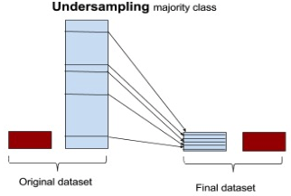

+++
title = "Imbalanced Classes"
date = 2019-10-22T00:00:00
lastmod = 2019-10-22T00:00:00
draft = false
reading_time = false
authors = ["Michael W. Brady"]
+++
At a high-level, [Tom Fawcett](https://www.svds.com/tbt-learning-imbalanced-classes/) outlines approaches to modeling with imbalanced classes as follows:

- *Balance the training set in some way:*
    - *Do nothing. Sometimes you get lucky and nothing needs to be done. You can train on the so-called natural (or stratified) distribution and sometimes it works without need for modification.*
    - Oversample the minority class.
    - Undersample the majority class.
    - Synthesize new minority classes.
- *Throw away minority examples and switch to an anomaly detection framework.*
- *At the algorithm level, or after it:*
    - Adjust the class weight (misclassification costs).
    - Adjust the decision threshold.
    - Modify an existing algorithm to be more sensitive to rare classes.
- *Construct an entirely new algorithm to perform well on imbalanced data.*

## Adjust the class_weight

Many sklearn classifiers have an option that allows you to adjust the weight each class receives. 'Balanced' is often a good first step to deal with imbalanced classes:

    class_weight = None # 'balanced' or dictionary 
    
    model = LogisticRegression(solver='lbfgs', class_weight=class_weight)

From [sklearn](https://scikit-learn.org/stable/modules/generated/sklearn.linear_model.LogisticRegression.html): "The “balanced” mode uses the values of y to automatically adjust weights inversely proportional to class frequencies in the input data as `n_samples / (n_classes * np.bincount(y))`"

### Imbalance-learn

A sklearn approved library which enables oversampling, undersampling, and synthesizing new classes. 

### Oversampling

Increase the population of minority class(es) by randomly replicating minority instances. 

Replicating instances causes variance to decrease (as identical instances are created) which increases the penalty (loss) of misclassifying that instance incorrectly. 

### Undersampling

Randomly select fewer instances from the majority class. The consequence of this approach is that the features can appear to have higher variance than they actually due as the dataset has been reduced. 

[scikit-learn-contrib/imbalanced-learn](https://github.com/scikit-learn-contrib/imbalanced-learn)