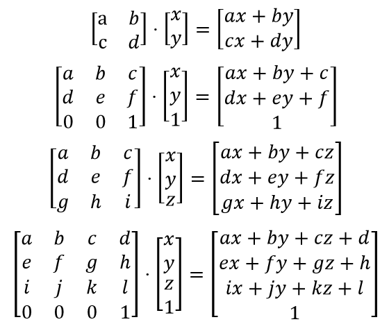
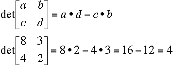
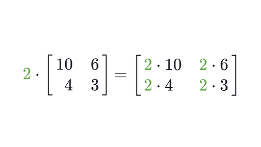
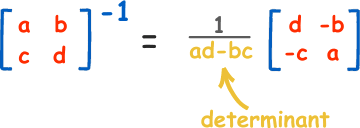
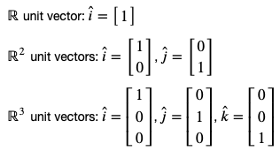

+++
title = "Linear Algebra Fundamentals"

date = 2019-10-22T00:00:00
lastmod = 2019-10-22T00:00:00
draft = false
reading_time = false

# Authors. Comma separated list, e.g. `["Bob Smith", "David Jones"]`.
authors = ["M. W. Brady"]
+++

[Linear algebra (numpy.linalg) - NumPy v1.15 Manual](https://docs.scipy.org/doc/numpy-1.15.1/reference/routines.linalg.html)

# Dot Product

The dot product of two vectors is the sum of the products of the corresponding numbers in each vector. 

$$v_1 = (1, 2, 3) \\ v_2 = (4,5,6) \\ v_1 \cdot v_2 = (1*4) + (2*5) + (3*6) = 32$$

The dot product of a vector and itself can be rewritten as that vector times the transpose of itself. 

### Python Implentation

    #dependencies
    import numpy as np
    
    # With numpy
    c = [7,22,4,16]
    d = [12,6,2,9]
    e = np.dot(c,d)
    
    # Custom Implementation
    def dot(v1, v2):
        '''
        Calculates the dot product of any two vectors of equal length
        
        Arguments:
            Accepts two vectors (arrays) of equal length
            
        Returns: 
            Dot product of arrays as an integer.
            Error message if given vectors are unqual length. 
        '''
        if len(v1) == len(v2):
            temp = 0
            for i in range(len(v1)):
                temp += v1[i] * v2[i]
            return temp
        else:
            return 'Error: Vector length is unequal'

# Matrix Multiplication

**For matrix multiplication to work the first matrix must have the same number of columns as the second matrix has rows.**  

To multiply matrices you take the dot product of vectors for each location in the output matrix. 

For each value in the output matrix, (*i, j*), take the dot product of the *i*th row and *j*th column of the respective input matrices. In this way, output matrices have the same number of columns as the second input matrix and the same number of rows as the first input matrix. 

Matrix multiplication is not commutative (order matters)!

### Python Implementation

    # Dependencies
    import numpy as np
    
    cd = np.matmul(C,D)

# The Determinant

The determinant can be thought of the scaling factor of the linear transformation described by the matrix. This is equivalent to the volume of the n-dimensional parallelepiped spanned by the columns or row vectors of the matrix. See this video for a crisp [visualization](https://www.youtube.com/watch?v=Ip3X9LOh2dk&vl=en). 

The calculation for finding the determinant of a 2x2 matrix is straightforward: 

Source: [Shodor](https://www.shodor.org/unchem/advanced/matrix/)

Beyond 2x2 matrices, the calculation becomes increasingly verbose. 

### Python Implementation

    # Dependencies
    from numpy import linalg
    
    # Define an array
    J = np.array([[0,1,2],
                 [7,10,4],
                 [3,2,0]])
    
    # Calculate the determinant
    linalg.det(J)

# Scalars

A single number (can be any real number), often used to 'scale' vectors or matrices by multiplying each vector/matrix value by the scalar.

Source: [Khan Academy](https://www.google.com/url?sa=i&rct=j&q=&esrc=s&source=images&cd=&cad=rja&uact=8&ved=2ahUKEwju85zF7-3hAhUSVN8KHVGxDpQQjB16BAgBEAQ&url=https%3A%2F%2Fwww.khanacademy.org%2Fmath%2Fprecalculus%2Fprecalc-matrices%2Fmultiplying-matrices-by-scalars%2Fa%2Fmultiplying-matrices-by-scalars&psig=AOvVaw1okvoxO5y1ahONbGMbNN6c&ust=1556371960987853)

### Python Implementation

    # Dependencies
    import numpy as np
    
    # Initialize vector
    a = [1,2]
    
    # Scale vector a by 5 
    b = np.multiply(a, 5)

# Norm of a Vector

The norm of a vector is simply that length of the vector. The norm is denoted by wrapping a vector in double pipes:

$$||a||$$

The norm is always ≥ to zero. The norm is only equal to zero if all elements of the vector are zero. The norm is found by taking the square root of the sum of all the squared elements:

$$||v|| =  \sqrt{v_{1}^2 + v_{2}^2 + \ldots + v_{n}^2} \\ \vec{a} =  \begin{bmatrix} 3 & 7 & 2 & 4 \end{bmatrix} \\ ||a|| = \sqrt{3^2 + 7^2 + 2^2 + 4^2} \\ ||a|| = \sqrt{9 + 49 + 4 + 16} \\ ||a|| = \sqrt{78}$$

The square of the norm of a vector is equivalent to the dot product of a vector with itself

### Python Implementation

    # With numpy
    from numpy import linalg
    
    e = np.array([[1],[1],[1],[8]])
    linalg.norm(e)
    
    # Custom implementation
    def norm(v):
        '''
        Calculates the norm (length) of a vector
        
        Arguments:
            Accepts a vectors (array)
            
        Returns: 
            Norm of array as an float.
        '''
    		import math
        num = 0
        for i in v: 
           num += i**2
        return math.sqrt(num)

# Inverse

The inverse is the reciprocal of the matrix used to generate it. Just like 1/N is the reciprocal of N. 

Source: [Math is Fun](https://www.google.com/url?sa=i&rct=j&q=&esrc=s&source=images&cd=&cad=rja&uact=8&ved=2ahUKEwjW1sXD8-3hAhUmmuAKHZB3D6QQjB16BAgBEAQ&url=https%3A%2F%2Fwww.mathsisfun.com%2Falgebra%2Fmatrix-inverse.html&psig=AOvVaw0aTc77yhEpf6HVKNqWL-dN&ust=1556373037258322)

The product of a matrix and its inverse is the identity matrix of the same dimensions as the original matrix. 

$$A^{-1}A = I $$

Two conditions must be true for a matrix to be invertible:

1. It must be square (equal dimensions)
2. The determinant must be non-zero

Square matrices with determinants equal to zero are known as 'singular.' One reason a matrix  would be singular is that one column is a multiple of another column (and thus linearly dependent). 

### Python Implementation

    # Dependencies
    import numpy as np
    from numpy import linalg
    
    # Find the inverse
    Jinv = linalg.inv(J)
    
    # Prove that the inverse times the matrix will produce an identity matrix
    np.matmul(J, Jinv)

# Transpose

A transposed matrix is one whose rows and columns are swapped relative to the original matrix. 

$$  B =  \begin{bmatrix}   1 & 2 & 3 \\   4 & 5 & 6 \end{bmatrix}   \qquad   B^{T} =    \begin{bmatrix}   1 & 4 \\   2 & 5 \\   3 & 6   \end{bmatrix}$$

### Python Implementation

    # Dependencies
    import numpy as np
    
    Ft = F.transpose()

# Orthogonality

Orthogonality can be thought of as perpendicularity. Thus two vectors that are perpendicular to one another are orthogonal. 

Two vectors are orthogonal if their dot product is equal to zero.

# Unit Vectors

A unit vector is any vector of 'unit length' (1). Any non-zero vector can be turned into a unit vector by dividing it by its norm: 

$$\hat{b} = \frac{1}{||b||}b = \frac{1}{3}\begin{bmatrix} 1 \\ 2 \\  2 \end{bmatrix} = \begin{bmatrix} \frac{1}{3} \\ \frac{2}{3} \\  \frac{2}{3} \end{bmatrix}$$

Standard unit vectors are often used to denote dimensional space: 

### Expressing vectors in terms of unit vectors and scalars

Vectors and matrices can be described in terms of a linear combination of scaled unit vectors. 

$$c = \begin{bmatrix} 2 \\ 3 \end{bmatrix} = 2\begin{bmatrix} 1 \\ 0 \end{bmatrix} + 3\begin{bmatrix} 0 \\ 1 \end{bmatrix} = 2\hat{i} + 3\hat{j}$$

# Span

The span is the set of all possible vectors that can be created with a linear combination of two vectors. 

- Linearly dependent vectors: Two vectors that fall on the same line are considered linearly dependent. This means that there is no linear combination of the two vectors that will ever allow us to reach outside of the line.
- Linearly independent vectors: Two vectors that do not lie on the same line as each other. Thus, any point in the vector space can be  cover via some linear combination of the two vectors.

Another way to think of the span is it is the graphical area that we're able to cover via a linear combination of a set of vectors.

# Basis

The basis of a vector space *V* is a set of vectors that are linearly independent and that span the vector space *V.*

For example, the two linearly independent vectors in R2 form a basis for the vector space R2 

# Rank

The rank of a matrix is the dimension of the vector space spanned by its columns. 

Just because a matrix has a certain number of rows or columns (dimensionality) doesn't necessarily mean that it will span that dimensional space. Sometimes there exists a sort of redundancy within the rows/columns of a matrix (linear dependence) that becomes apparent when we reduce a matrix to row-echelon form via Gaussian Elimination.

### Python Implementation

    # Dependencies
    from numpy import linalg
    
    P = np.array([[1,2,3],
                [-1,0,7],
                [4,8,2]])
    
    linalg.matrix_rank(P)

# Gaussian Elimination

Gaussian Elimination is a process that seeks to take any given matrix and reduce it down to "Row-Echelon form." 

A matrix is in Row-Echelon form when it has a 1 as its leading entry (furthest left) in each row, and zeroes at every position below that main entry. These matrices will usually wind up as a sort of upper-triangular matrix (not necessarily square) with ones on the main diagonal.

Gaussian Elimination takes a matrix and converts it to row-echelon form by doing combinations of three different row operations:

1) You can swap any two rows

2) You can multiply entire rows by scalars

3) You can add/subtract rows from each other
