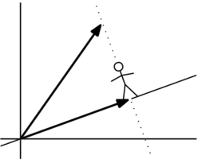
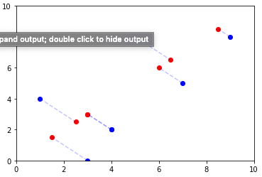

+++
title = "Linear projections"

date = 2019-10-22T00:00:00
lastmod = 2019-10-22T00:00:00
draft = false
reading_time = false
authors = ["Michael W. Brady"]
+++

Linear projections find the shortest distance between a data point (vector) and a line.

One classic way to think about linear projections is that they are the shadow that the data point (vector) casts onto the line: 

 

Source: [Wikibooks](https://www.google.com/url?sa=i&rct=j&q=&esrc=s&source=images&cd=&cad=rja&uact=8&ved=2ahUKEwi7u6Kw--3hAhVsU98KHfQMCLkQjB16BAgBEAQ&url=https%3A%2F%2Fen.wikibooks.org%2Fwiki%2FLinear_Algebra%2FOrthogonal_Projection_Onto_a_Line&psig=AOvVaw2Ry_XrtJ96tVBrgyWm-tSe&ust=1556375141789788)

Projected vector can be with the following formula: 

$$proj_{L}(w) =  \frac{w \cdot v}{v \cdot v}v$$

### Python Implementation

    # Find the projection of vector w onto line L
    
    # Initialize vectors
    v = [1, 3]
    w = [-1, 2]
    
    # Calculate numerator 
    numerator = get_dot_product(w, v)
    
    # Calculate denominator
    denominator = get_dot_product(v, v)
    
    # Calculate the projected vector
    proj_w = np.multiply((numerator / denominator),v)

### Visualizing multiple linear projections at once

    # Dependencies
    import pandas as pd
    import matplotlib.pyplot as plt
    
    # Create data
    x_values = [1, 4, 7, 3, 9, 4, 5 ]
    y_values = [4, 2, 5, 0, 8, 2, 8]
    
    data = {"x": x_values, "y": y_values}
    
    df = pd.DataFrame(data)
    
    # Find the dot product of two vectors 
    def get_dot_product(a,b):
        sum = 0
        for i in range(len(a)):
            sum += a[i]*b[i]
        return sum
    
    # Find the projected vectors 
    def get_projection(v1, v2=np.array([4,4])):
        import numpy as np
        proj = np.multiply( (get_dot_product(v1, v2) / get_dot_product(v2, v2) ), v2)
        return proj
    
    # Visualize the projections 
    def add_projection(df, x_col, y_col):
        import matplotlib.pyplot as plt
        import numpy as np
        import pandas as pd
        for i in range(len(df)):
            # Convert x and y values to vector
            v1 = np.array([df[x_col][i],df[y_col][i]])
            # Calculate projection vector
            proj = get_projection(v1)
            # Plot projection vector (represented as points)
            plt.scatter(proj[0], proj[1], color='r')
            # Plot line between vector and projection points
            plt.plot([ df[x_col][i], proj[0] ], [ df[y_col][i] , proj[1] ], alpha=0.2, color='b', linestyle='--')
        #plot x and y values
        plt.scatter(df[x_col],df[y_col], color='b')
        plt.xlim(0,10)
        plt.ylim(0,10)
        #Show plot
        plt.show()
        
    # Input our data into the function
    add_projection(df, 'x', 'y')

