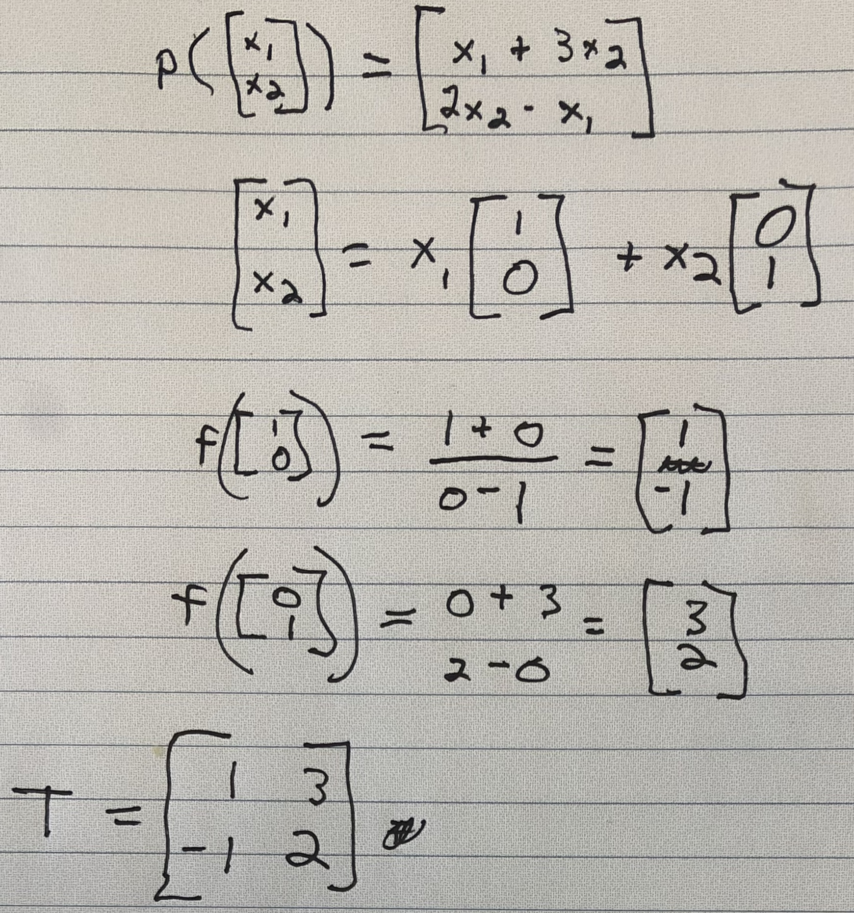

+++
title = "Linear transformations"

date = 2019-10-22T00:00:00
lastmod = 2019-10-22T00:00:00
draft = false
reading_time = false
authors = ["Michael W. Brady"]
+++

Linear transformations can be thought of as the composition of smaller transformations (like scaled unit vectors being added together). For more see this [video](https://www.youtube.com/watch?v=kYB8IZa5AuE). 

This is true because a valid linear transformation must be associative: 

$$T(u+v) = T(u)+T(v)$$

Further, valid linear transformations can accept a scaling vector (denoted as *c):*

$$T(cu) = cT(u)$$

## Transformation Matrices

Any linear transformation can be described with matrix vector multiplication, where the columns of the transformation matrix come from passing in the dimension of the appropriate unit vectors into the function. 

We can use the transformation matrix to perform linear combinations with the following: 

    # Dependencies
    import numpy as np
    
    # Transformation matrix
    pT = np.array([[1,3],[-1,2]])
    
    # Input matrix
    ptest = np.array([[2],[1]])
    
    # Resulting matrix 
    result = np.matmul(pT, ptest)

We can verify that the transformation matrix works by mapping our input array to the original output matrix described in the function: 

    result = np.array([[2+3*1],[2*1-2]])