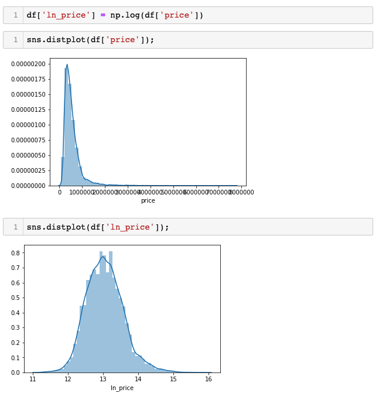

+++
title = "Log-Linear Regression"

date = 2019-10-22T00:00:00
lastmod = 2019-10-22T00:00:00
draft = false
reading_time = false
authors = ["Michael W. Brady"]
+++
Linear Regression is linear not because it can only plot straight lines and fit straight-line patterns in data, but because the form of the equation used to represent our regression is in the form of a Linear Equation.

### Log-Linear Regression

Take the natural log of our y variable and use that as our t vector instead of the raw y values.

***Can be used to reduce skew in y:*** The fact of the matter is that we will be able to make better predictions if we can normalize our data to some degree and one way to do this is by taking the natural log of it.

***More interpretable:*** With log-linear regression, root mean squared error is interpreted as the percentage we are off (rather than absolute value)

- Coefficients are also interpreted in percentage terms

### Python Implementation

    from sklearn.linear_model import LinearRegression
    import pandas as pd
    import numpy as np
    
    
    X = moore[[feature]] # Double brackets only necesary when using a single feature
    y = np.log(moore[target]) # Apply natural log function to the target
    model = LinearRegression()
    model.fit(X, y)
    y_pred = np.exp(model.predict(X)) # Apply exponential function (inverse of natural log) to the predictions
    print('R^2', model.score(X, y))