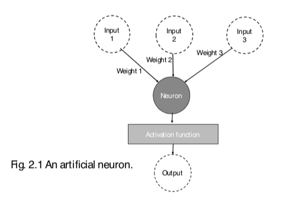

+++
title = "Neural Network Fundamentals"

date = 2019-10-22T00:00:00
lastmod = 2019-10-22T00:00:00
draft = false
reading_time = false

# Authors
authors = ["Michael W. Brady"]
+++
Neural networks can be thought of as a function or 'mapping' of inputs to outputs (just like many other learning algorithms). Neural networks have three main layers:

- **Input Layer:** Receives input from our dataset. Typically node maps are drawn with one input node for each of the different  inputs/features/columns of our dataset
- **Hidden Layers:** Layers in between the input layer and the output layers.
- **Output layers:** The final layer. Typically the output layer outputs a vector of values in a format suitable for the type of problem to be addressed. Often the output value is modified by an 'activation function' to transform it into a format that makes sense for a given context.

When describing neural networks it is common to encounter the following terminology: Size (# of nodes in model), Width (# of nodes in specific layer), Depth (# of layers in a neural network), Architecture (arrangement of layers and nodes in the network). 

**Bias:** the bias term interacts with a single layer to affect all layers after the hidden layer that it is associated with. Often you use the bias term to ensure that the neuron 'fires'. Most of the time it is abstracted away from the programmer in DL libraries. 

Optimal weights and biases can be found through descent if there is a loss function that evaluates the quality of our predictions compared to the targets in our training data. 

### Perceptron

A perceptron is a single node or neuron of a neural network. A perceptron takes any number of inputs and produces an output. Essentially a neuron takes each input values, multiplies it by a weight, sums all the products, and passes the sum through an activation function which produces the final value. 

### Activation Functions

Each node in a given layer typically has the same activation function. Activation functions decide how much signal is passed onto the next layer (how on or off the node is). They take in a weighted sum of inputs (and a bias) from the previous layer and output an activation value. Activation functions also impact backpropagation as it affects how weights are updated in reverse order as activated weight sums become the inputs of the next layer

A popular activation function is the sigmoid: 

    def sigmoid(x):
        return 1 / (1+np.exp(-x))
    
    def sigmoid_derivate(x):
        sx = sigmoid(x)
        return sx * (1 - sx)

- **Step Function:** All or nothing (either on or off). Makes updating weights with backpropogation impossible (cannot take derivative of step function).

    

- **Linear Function:** Passes signal onto the next layer by a constant factor. The derivative of any linear function is a horizontal line which would indicate that we should update all weights by a constant amount every time -which on balance wouldn't change the behavior of our network.

    

- **Sigmoid Function:** Continuously differentiable, its derivative doesn't have a constant slope, and having the higher slopes in the middles pushes y values towards extremes which is particularly useful for binary classification problems.

    

    The main problem with sigmoid functions is that the slope gets pretty flat quickly after its departure from zero. This means that updating weights based on its gradient diminishes the size of our weight updates as our model gets more confident about its classifications. 

- **Tanh Function:** Similar to the sigmoid but steeper in the middle and less flat on the ends. The higher slop around 0 causes weights to move to extremes faster.

    

- **ReLU Function:** Most common activation function used in modern neural networks. ReLU turns off nuerons with negative values and passes on ones with positive values. Helps the network learn faster what is more important. Our gradient will never update nuerons with negative weights. This means we may want to 'turn back on nuerons' in case they get turned off by chance in the early stages of model training.

    

- **Leaky ReLU Function:** Like ReLU but avoids have a gradient on the left side of its derivative function (meaning negative values get passed on).

    

- **Softmax Function:** Like the sigmoid function but more useful for multi-class classification problems. Can take any set of inputs and translate them into probabilities that sum up to 1. ****

    

### Loss

The error or loss for a given observation can be calculated by taking the square of the difference between the predicted value and the actual value. The overall quality of a NN's predictions can be summarized by taking the square of the difference between the predicted and the actual value. 

A key hyperparameter when building a neural network is selecting an appropriate loss function. Per [Jason Brownlee](https://machinelearningmastery.com/how-to-choose-loss-functions-when-training-deep-learning-neural-networks/), common loss functions can be broken down as follows:

1. **Regression Loss Functions** — Typically pair with an output layer that has a `linear` activation function
    1. **Mean Squared Error Loss** — The default loss function to use for regression problems. MSE is the calculated squared differences between predicted and actual values. This punishes the model for larger mistakes. Can be specified in Keras as `mse` or `mean_squared_error`
    2. **Mean Squared Logarithmic Error Loss** — Useful if target has large spread of values and when predicting large values you don't want to punish the model as heavily as normal mse. Calculates the natural log of each of the predicted values then calculates the mse. Can be specified in Keras with `mean_squared_logarithmic_error`
    3. **Mean Absolute Error Loss** — Useful if the target distribution has a large outliers. Calculates the average absolute difference between the actual and predicted values. Can be specified in Keras with `mean_absolute_error`
2. **Binary Classification Loss Functions** — classification problems with only two classes (e.g., 0 or 1)
    1. **Binary Cross-Entropy** — The default loss function to use for binary classification problems. Calculates a score that summarizes average difference between actual and predicted probability distributions. Score is minimized and perfect cross-entropy value is 0. Specified in Keras with `binary_crossentropy` 

        Must be paired with an output layer with a single node and a `sigmoid` activation function

3. **Multi-Class Classification Loss Functions —** for classification problems with more than 2 classes
    1. **Multi-Class Cross-Entropy Loss** — The default function to use for multi-class classification problems. Can be specified in Keras with `categorical_crossentropy` 

        Requires the output layer to have one node for each class, that the output layer uses a `softmax` activation function, and that the target be one-hot encoded.

        One hot encoding the target can be done with: 

            from keras.utils import to_categorical
            
            y = to_categorical(y)

### Epoch

An 'epoch' is one cycle of passing all the data forward through the network, measuring error, and updating weights within the network.

### Gradient Descent

Due to the nonlinearity of NN models it is common to encounter local minimums. Stochastic Gradient descent is a common approach to mitigating this problem. 

### Minibatch Gradient Descent

Instead of passing all of our data through the network for a given epoch, a randomized portion of our data is passed through the network for each epoch. Batch size is an important hyperparameter to tune.  

## Neural Networks have lots of hyper-parameters

Which makes them difficult to train:

1. You need more data to train on
2. They take a long time to train (computationally expensive)
3. Lots of hyperparameters means lots of tuning (training model many times)

Further, the optimal architecture of neural networks (layers and nodes) essentially requires a process of guess and check. At best one can try and transfer parameters found in literature or use intuition, but ultimately systematic testing is the only true approach. 

### Backpropagation

Refers to how weights are updated in reverse order at the end of each training epoch.

### Sensible Hyperparameter Tuning

Grid search can be extremely computationally expensive when tuning a neural network. For the most part a realistic approach is to test one hyperparameter at a time with grid search. While there are relationships between hyperparameters, there tends to be less inter-hyperparameter relationship than one might expect.

Most important hyperparameters to test:

- **batch_size** — Determines how many observations the model is shown before it calculates loss/error and updates the model weights via gradient descent.
- **training epochs** — The number of passes through the dataset the model makes during training (more is usually better, but computationally expensive)
- **optimization algorithms** — Usually the best is 'adam'. Optimizers have hyperparameters that can also be tuned...
- **learning rate** — specific to the gradient-descent optimizer, determines how quickly the algorithm 'descends'. You need to find the happy medium between too fast and too slow
- **momentum** — Decides the willingness of an optimizer to overshoot the minimum. Momentum is primarily associated with stochastic gradient descent
- **activation functions** — Rule of thumb is relu for hidden layers, sigmoid for binary classification, and softmax for multi-class classification
- **number of hidden layers + number of neurons in hidden layers** — More nodes and layers increase computational intensiveness and likelihood of overfitting. Typically more layers is more important the more nodes for improving performance. A good approach is to research what architectures other people have used for similar problems and start with that.

Note, use a small number of epochs while tuning other hyperparameters to limit training time.

**Grid Search Syntax:**

Keras models can be used in scikit-learn by wrapping them with `KerasClassifier` or `KerasRegressor` — using these wrappers requires creating a function which builds the keras model and passing the function to the `build_fn` argument.

    from sklearn.model_selection import GridSearchCV
    
    # define the grid search parameters
    # dictionary keys need to match hyperparameter names
    param_grid = {'batch_size': [10, 20, 40, 60, 80, 100],
                  'epochs': [20]}
    
    # Create Grid Search
    grid = GridSearchCV(estimator=model, param_grid=param_grid, n_jobs=1)
    grid_result = grid.fit(X, Y)
    
    # Report Results
    print(f"Best: {grid_result.best_score_} using {grid_result.best_params_}")
    means = grid_result.cv_results_['mean_test_score']
    stds = grid_result.cv_results_['std_test_score']
    params = grid_result.cv_results_['params']
    for mean, stdev, param in zip(means, stds, params):
        print(f"Means: {mean}, Stdev: {stdev} with: {param}")

The result object returned by `grid.fit()` contains a `best_score_` and `best_params_` attribute. 

One can tune parameters specified during model construction by passing them as attributes to the model creation function. The below snippet from Brownlee demonstrates this: 

    # Function to create model, required for KerasClassifier
    def create_model(optimizer='adam'):
    	# create model
    	model = Sequential()
    	model.add(Dense(12, input_dim=8, activation='relu'))
    	model.add(Dense(1, activation='sigmoid'))
    	# Compile model
    	model.compile(loss='binary_crossentropy', optimizer=optimizer, metrics=['accuracy'])
    	return model
    # fix random seed for reproducibility
    seed = 7
    numpy.random.seed(seed)
    # load dataset
    dataset = numpy.loadtxt("pima-indians-diabetes.csv", delimiter=",")
    # split into input (X) and output (Y) variables
    X = dataset[:,0:8]
    Y = dataset[:,8]
    # create model
    model = KerasClassifier(build_fn=create_model, epochs=100, batch_size=10, verbose=0)
    # define the grid search parameters
    optimizer = ['SGD', 'RMSprop', 'Adagrad', 'Adadelta', 'Adam', 'Adamax', 'Nadam']
    param_grid = dict(optimizer=optimizer)
    grid = GridSearchCV(estimator=model, param_grid=param_grid, n_jobs=-1)
    grid_result = grid.fit(X, Y)
    # summarize results
    print("Best: %f using %s" % (grid_result.best_score_, grid_result.best_params_))
    means = grid_result.cv_results_['mean_test_score']
    stds = grid_result.cv_results_['std_test_score']
    params = grid_result.cv_results_['params']
    for mean, stdev, param in zip(means, stds, params):
        print("%f (%f) with: %r" % (mean, stdev, param))

**Network weight initialization:**

    def create_model(init_mode='uniform'):
    	# create model
    	model = Sequential()
    	model.add(Dense(12, input_dim=8, kernel_initializer=init_mode, activation='relu'))
    	model.add(Dense(1, kernel_initializer=init_mode, activation='sigmoid'))
    	# Compile model
    	model.compile(loss='binary_crossentropy', optimizer='adam', metrics=['accuracy'])
    	return model
    
    # define the grid search parameters
    init_mode = ['uniform', 'lecun_uniform', 'normal', 'zero', 'glorot_normal', 'glorot_uniform', 'he_normal', 'he_uniform']
    param_grid = dict(init_mode=init_mode)
    grid = GridSearchCV(estimator=model, param_grid=param_grid, n_jobs=-1)
    grid_result = grid.fit(X, Y)

**Activation Functions:** Note often you don't want to tune the output layer activation function as that is defined by the type of problem (e.g., sigmoid=binary_classification). Further, different functions may work best with data prepared in certain ways.

    def create_model(activation='relu'):
    	# create model
    	model = Sequential()
    	model.add(Dense(12, input_dim=8, kernel_initializer='uniform', activation=activation))
    	model.add(Dense(1, kernel_initializer='uniform', activation='sigmoid'))
    	# Compile model
    	model.compile(loss='binary_crossentropy', optimizer='adam', metrics=['accuracy'])
    	return model
    
    activation = ['softmax', 'softplus', 'softsign', 'relu', 'tanh', 'sigmoid', 'hard_sigmoid', 'linear']
    param_grid = dict(activation=activation)
    grid = GridSearchCV(estimator=model, param_grid=param_grid, n_jobs=-1)
    grid_result = grid.fit(X, Y)

**Dropout Regularization:** In practice dropout and weight constraint should be tuned together. Dropout rate helps avoid overfitting. 

    def create_model(dropout_rate=0.0, weight_constraint=0):
    	# create model
    	model = Sequential()
    	model.add(Dense(12, input_dim=8, kernel_initializer='uniform', activation='linear', kernel_constraint=maxnorm(weight_constraint)))
    	model.add(Dropout(dropout_rate))
    	model.add(Dense(1, kernel_initializer='uniform', activation='sigmoid'))
    	# Compile model
    	model.compile(loss='binary_crossentropy', optimizer='adam', metrics=['accuracy'])
    	return model
    
    # define the grid search parameters
    weight_constraint = [1, 2, 3, 4, 5]
    dropout_rate = [0.0, 0.1, 0.2, 0.3, 0.4, 0.5, 0.6, 0.7, 0.8, 0.9]
    param_grid = dict(dropout_rate=dropout_rate, weight_constraint=weight_constraint)
    grid = GridSearchCV(estimator=model, param_grid=param_grid, n_jobs=-1)
    grid_result = grid.fit(X, Y)

Number of Neurons:

    def create_model(neurons=1):
    	# create model
    	model = Sequential()
    	model.add(Dense(neurons, input_dim=8, kernel_initializer='uniform', activation='linear', kernel_constraint=maxnorm(4)))
    	model.add(Dropout(0.2))
    	model.add(Dense(1, kernel_initializer='uniform', activation='sigmoid'))
    	# Compile model
    	model.compile(loss='binary_crossentropy', optimizer='adam', metrics=['accuracy'])
    	return model
    
    # define the grid search parameters
    neurons = [1, 5, 10, 15, 20, 25, 30]
    param_grid = dict(neurons=neurons)
    grid = GridSearchCV(estimator=model, param_grid=param_grid, n_jobs=-1)
    grid_result = grid.fit(X, Y)

[How to Grid Search Hyperparameters for Deep Learning Models in Python With Keras](https://machinelearningmastery.com/grid-search-hyperparameters-deep-learning-models-python-keras/)

## Dropout Regularization and Weight

Turning on dropout regularization is most useful if a model is overfitting. Dropout regularization controls the percentage of neurons that are randomly deactivated during training. This means that 'dropped-out' neurons do not contribute to the activation of downstream neurons and weight updates are not applied to the neuron on the backward pass.

The intended effect of dropout regularization is that the network becomes less reliant on any one nueron or set of weights ... leading to better generalization. Dropout is only used when training the model. 

Typically a dropout rate between 20-50% is ideal. Dropout typically works best with larger networks. It makes sense to use dropout on both visible (incoming) and hidden layers — research suggests using it on each layer can be effective. A large learning rate with decay (increase by 10-100x) and momentum (0.9-.99) is advised. Constrain the size of network weights to between 3-5 — a large learning rate can result in very large network weights. 

[Dropout Regularization in Deep Learning Models With Keras](https://machinelearningmastery.com/dropout-regularization-deep-learning-models-keras/)

## Network Weight Initialization

Set the weights assigned at initialization. Setting good initial weights can accelerate model training (less epochs required). There are lots of potential initialization modes.