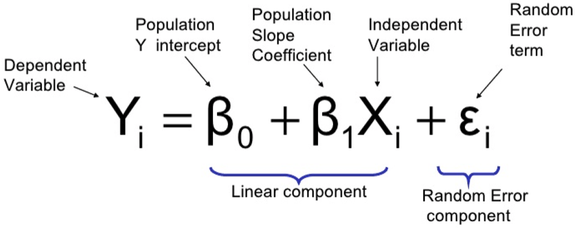

+++
title = "Ordinary Least Squares Regression"

date = 2019-10-22T00:00:00
lastmod = 2019-10-22T00:00:00
draft = false
reading_time = false
authors = ["Michael W. Brady"]
+++
Linear Regression is a statistical model that seeks to describe the relationship between some y variable and one or more x variables.

### Residual Error

Distance between points in our dataset and our regression line

### Ordinary Least Squares (OLS)

**Ordinary Least Squares (OLS) Regression minimizes the sum of squared errors (residuals).** We calculate alpha and beta values for the case in which the sum of all squared residuals is minimal.

We take the square of the residual so that:

- Positive and negative deviation do not cancel each other out
- Especially large residuals receive a stronger weight due to squaring

By convention, the X variable is capitalized and the y variable is lowercase (X is a matrix and y is a vector)

*Note: sklearn's convention is that attributes which can only be accessed after a model has been fitted are denoted with a '_' at the end (e.g., model.coef_ )*

### Why Linear Regression?

Two distinct advantages of linear regression are:

1. **Interpretability:** Variables linked directly to coefficients allows for clear interpretation. 
2. **Simplicity:** A linear regression can be communicated just by writing out its equation. 

### Bivariate Regression

Bivariate (simple) regression involves a single x variable and a single y variable. 

- **X:** Feature, independent variable
- **Y:** Target, dependent variable
- **Beta Zero:** The intercept value (how much y if x is zero?)
- **Beta One:** Slop of the line that is estimated by minimizing the sum of squared errors
- **Epsilon:** The error term for things outside of our model that impact y

### An example of a Bivariate Model

$$sales_i = -596.2 + 24.69temperature + \epsilon$$

*What might -596.2 represent?* The level of sales that we would have if temperature were 0. 

*What might 24.69 represent?* It represents the increase in sales for each degree of temperature increase. For every degree that the temperature goes up outside sales increase by $25.

### Visualizing a Simple (Bivariate) Regression

    # Dependencies
    import matplotlib.pyplot as plt
    
    # Iniative figure
    plt.figure(figsize=(10,5))
    
    # Plot data
    plt.scatter(train[feature], train[target], alpha=0.1)
    
    # Plot line of best fit
    plt.plot(train[feature], train['predictions'], '--', color='g')
    
    # Add Context to visualization
    plt.title('')
    plt.xlabel('')
    plt.ylabel('')
    
    plt.show()

### Multiple Regression

Multiple regression involves multiple x variables.

As we increase the number of x variables in a model we are simply fitting a n-dimensional plane to an n-dimensional cloud of points within an n-dimensional hypercube.

### Python Implementation

    # Dependencies
    import pandas as pd
    from sklearn.linear_model import LinearRegression
    from sklearn.model_selection import train_test_split
    from sklearn.metrics import mean_squared_error, r2_score
    
    # Split the data into train and test dataframes
    train, test = train_test_split(df, train_size=0.8, test_size=0.2, random_state=42)
    
    # Establish features and target from dataset
    features = ['sqft_living15', 'grade']
    target = ['price']
    
    # Initiate and fit the model
    model = LinearRegression()
    model.fit(train[features], train[target])
    
    # Access feature coefficients and the y-intercept
    multiple.coef_, multiple.intercept_
    
    # Assess model performance 
    train_true = train[target]
    train_pred = model.predict(train[feature])
    
    test_true = test[target]
    test_pred = model.predict(test[feature])
    
    print('Train:')
    # Train Mean Squared Error
    print('Mean Squared Error: ', mean_squared_error(y_true=train_true, y_pred=train_pred) )
    # Train R Squared
    print('R Squared: ', r2_score(y_true=train_true, y_pred=train_pred) )
    print('Test:')
    # Test Mean Squared Error
    print('Mean Squared Error: ', mean_squared_error(y_true=test_true, y_pred=test_pred) )
    # Test R Squared
    print('R Squared: ', r2_score(y_true=test_true, y_pred=test_pred) )

### R Squared

Percentage of the dependent variable that is explained by the model. R squared is a statistical measure of how close the data is fitted to a regression line.

For this reason the `R^2` is also known as the 'coefficient of determination', as it explains how much of y is explained (or determined) by our x variables. 

While R Squared is valuable to tell how well a model fits the data, it does not tell us anything about overfitting. To guard against overfitting we need to be use test data.

### Python Implementation

    # Dependencies
    from sklearn.metrics import r2_score
    
    r2_score(y_true=test_true, y_pred=test_pred)

### **Synonyms for 'y variable'**

- Dependent Variable
- Response Variable
- Outcome Variable
- Predicted Variable
- Measured Variable
- Explained Variable
- **Label**
- **Target**

### **Synonyms for 'x variable'**

- Independent Variable
- Explanatory Variable
- Regressor
- Covariate
- **Feature**

### Helpful Resources (beyond documentation)

[Regression Analysis: An Overview](https://www.kellogg.northwestern.edu/faculty/weber/jhu/statistics/regression.htm)

