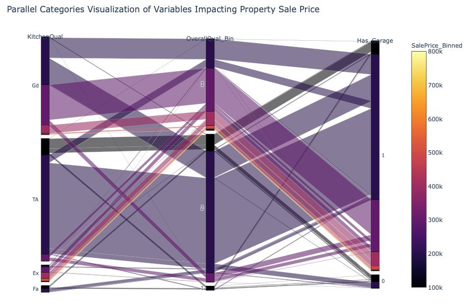

+++
title = "Building a Parallel Categories Visualization w/Plotly Express"
date = 2019-10-22T00:00:00
lastmod = 2019-10-22T00:00:00
draft = false
reading_time = false
authors = ["Michael W. Brady"]
+++

import plotly_express as px
    
    px.parallel_categories(df, 
                           dimensions=['OverallQual_Bin', 'Has_Garage','KitchenQual'], 
                           color='SalePrice_Binned', 
                           color_continuous_scale=px.colors.sequential.Inferno,
                           width=1000,
                           height=700,
                           title='Parallel Categories Visualization of Variables Impacting Property Sale Price')

[plotly_express API documentation](https://www.plotly.express/plotly_express/)

[Plotly Express](https://www.plotly.express)