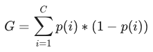

+++
title = "Random Forests"
date = 2019-10-22T00:00:00
lastmod = 2019-10-22T00:00:00
draft = false
reading_time = false
authors = ["Michael W. Brady"]
+++
From [Sklearn](https://scikit-learn.org/stable/modules/ensemble.html#random-forests):

*In random forests, **each tree in the ensemble is built from a sample drawn with replacement** (i.e., a bootstrap sample) from the training set. In addition, when splitting a node during the construction of the tree, the split that is chosen is no longer the best split among all features. Instead, **the split that is picked is the best split among a random subset of the features**. As a result of this randomness, the bias of the forest usually slightly increases (with respect to the bias of a single non-random tree) but, **due to averaging, its variance also decreases, usually more than compensating for the increase in bias, hence yielding an overall better model.***

Creating ensembles of decision trees with boosting or bagging addresses the tendency for single decision trees to overfit data if grown to unlimited depth

One hot encoding is typically not the best way of encoding categorical data for tree ensembles.

**The random parts of random forests:**

- Each tree trains on a random bootstrap sample of the data
- Each split considers a random subset of the features (can be adjusted in sklearn with 'max_features' attribute) ... this is known as bagging

## Bagging

> Involves creating multiple copies of the original training data set using bootstrap, fitting a separate decision tree to each copy with a random subset of features, and then combining all of the trees to create a single model

## Boosting

> Boosting is similiar to bagging, but instead of simaltaneously, the decision trees are grown sequentially. Each tree uses the residuals from the prior tree as training data.

Fitting small trees to the residuals, allows the model to improve in areas where it does not perform well.

## Plot Feature Importance

    importances = pd.Series(model.feature_importances_, X_train.columns)
    title = f'{name}, max_depth={model.max_depth}'
    importances.sort_values().plot.barh(color='grey', title=title)
    plt.show()

### Running XGBoost Locally

There is a widespread bug that requires the following the remedy in local installs:

    import os
    os.environ['KMP_DUPLICATE_LIB_OK']='True'

[Random Forests for Complete Beginners - victorzhou.com](https://victorzhou.com/blog/intro-to-random-forests/)

## Gini Impurity

> Gini impurity is the probability of incorrectly classifying a randomly chosen element in the dataset if it were randomly labeled according to the class distribution in the dataset

C is the number of classes, p(i) is the probability of randomly picking an element of class i

> When training a decision tree, the best split is chosen by maximizing the Gini gain (calculated by subtracting the weighted impurities of the branches from the original impurity).

[A Simple Explanation of Gini Impurity - victorzhou.com](https://victorzhou.com/blog/gini-impurity/)