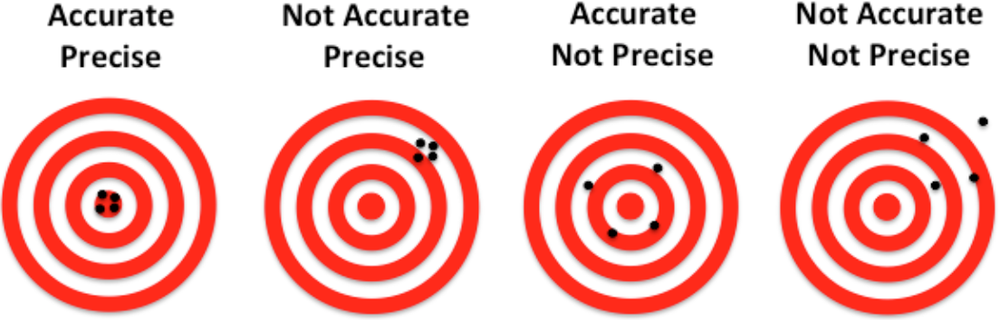
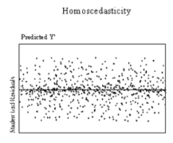
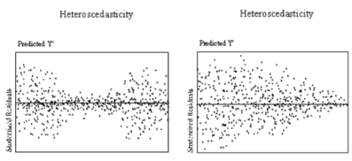

+++
title = "Regression diagnostics"

date = 2019-10-22T00:00:00
lastmod = 2019-10-22T00:00:00
draft = false
reading_time = false

# Authors. Comma separated list, e.g. `["Bob Smith", "David Jones"]`.
authors = ["Michael W. Brady"]
+++
Note, regression diagnostics are typically not a critical element of predictive modeling as the goal is to maximize predictive accuracy. However, in  situations were explainability and interpretability are important regression diagnostics is critical. 

### Stats Model

In order to diagnose and interpret a OLS regression, it is necessary to use the statsmodel library:

    import statsmodels.api as sm
    
    # Note for statsmodels OLS a contsant column has to be included as a feature
    model = sm.OLS(y, sm.add_constant(X))
    results = model.fit()
    print(results.summary())

### Regression Coefficients

An estimated regression coefficient represents the mean change in our target (dependent variable) given a one unit change in the feature. As it is an estimate, a confidence interval can be constructed to help interpret the reliability of the coefficient. 

Given a coefficient is the estimated mean effect of x on y, **the standard error of a coefficient is the estimated standard deviation of the coefficient.** 

### Accuracy

A regression coefficient that is accurate is centered around its 'true' value. 

We don't actually know what the true value is though, so it is more like we suspect it represents ground truth

### Precision

A regression coefficient that is 'precise' has a small standard error. It has a tighter confidence interval as well. 

### Interpreting a P-Value of a coefficient

The p-value for each term tests the null hypothesis that the coefficient is equal to zero (no effect). A low p-value (< 0.05) indicates that you can reject the null hypothesis. In other words, a predictor that has a low p-value is likely to be a meaningful addition to your model because changes in the predictor's value are related to changes in the response variable. ([Minitab](http://blog.minitab.com/blog/adventures-in-statistics-2/how-to-interpret-regression-analysis-results-p-values-and-coefficients))

### Jarque-Bara

A test for high levels of collinearity (high number indicates that high level of collinearity are present)

### Collinearity

Two variables that are close to being a linear combination.

High collinearity is bad for interpretability because it increases standard errors and therefore makes estimates of coefficients less precise. 

### Perfect MultiCollinearity

Variables that are linearly dependent (exist on the same line). Perfect multicollinearity breaks OLS because it makes a matrix not invertible

### Variance Inflation Factor

The Variance Inflation Factor is the **ratio of variance in a model with multiple terms divided by the variance of a model with one term alone.** It quantifies the severity of collinearity in a model. 

As a rule of thumb any variable that has a VIF > 10 needs to be dealt with (probably dropped from your model). If you see a VIF greater than 10 it is likely that two x variables are highly correlated. Remember that we can use the correlation matrix to check levels of correlation between our independent variables.

    from statsmodels.stats.outliers_influence import variance_inflation_factor
    
    X = sm.add_constant(df[features])
    vif = [variance_inflation_factor(X.values, i) for i in range(len(X.columns))]
    pd.Series(data=vif, index=X.columns)

### Homoskedasticity

Homoskedasticity means that along our entire domain (x axis) the residuals are about the same distance from our regression line (on average). 

### Heteroskedasticity

Our data points exhibit heteroskedasticity when then don't exhibit homoskedasticity

If we need to interpret our coefficients than we should correct heteroskedasticity. To do so, we use 'robust standard errors', which correct heteroskedasticity with minimal side effects. 

This can be done with the Stats library by setting the cov_type to 'HC3'

    model = sm.OLS(df[target], df[features])
    results = model.fit(cov_type='HC3')
    print(results.summary())

[Gauss Markov Theorem & Assumptions](https://www.statisticshowto.datasciencecentral.com/gauss-markov-theorem-assumptions/)