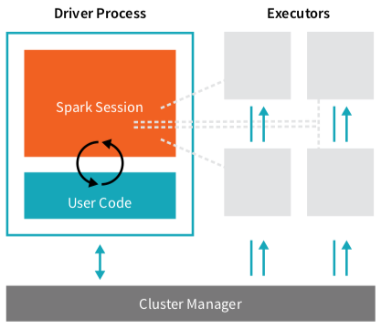

# Spark

> Spark is a tool for managing and coordinating the execution of tasks on data across a cluster of computers.

- The cluster manager is responsible for maintaining an understanding of the resources available. It controls physical machines and allocates resources.
- The driver process distributes the commands (generated by user code) across the executors in order to complete the command.
- Executors do two things: (1) execute code assigned by the driver process and (2) report on the state of the computation.
- The spark session instance is the way Spark executes user-defined commands across the cluster. In Scala it can be accessed through the variable `spark`
- User Code is translated using the Spark API, into spark code. The default language is Scala.

> The fundamental difference between a traditional Pandas DataFrame and a Spark DataFrame is that while a Pandas DataFrame typically sites on one computer in one specific location, a Spark DataFrame can span thousands of computers.

To enable every executor to work in parallel, DataFrames are automatically broken up into chunks, call partitions. *A partition is a collection of rows that sit on one physical machine in a cluster.* 

Spark core data structures are immutable. These means transformations must be used to modify a data structure (e.g., DataFrame) into what we want. There are two types of transformations: 

- Narrow dependencies: each input partition contributes to only one output partition. Narrow dependencies are handled in memory.
- Wide dependencies: input partitions contribute to many output partitions. The process Spark uses to execute wide dependencies is known as a shuffle. To perform a shuffle, Spark will write to disk.

Spark transformations are executed with lazy evaluation—Spark waits until the end to execute transformations. This allows Spark to build an efficient plan to run our transformations as efficiently as possible across the cluster. To view the efficient plan Spark plan to execute, the .explain() command can be used.

To trigger the computation of transformations, we run an action. An action instructs Spark to compute a result from a series of transformations

There are three kinds of action: (1) actions to view data in the console, (2) actions to collect data to native objects in the respective language, and (3) actions to write to output data sources.

> A Spark job represents a set of transformations triggered by an individual action and we can monitor that from the Spark UI.

The Spark UI maintains information on the state of Spark jobs, environment, and cluster state. 

Data queries can be wrote with SQL or DataFrame methods, both methods will be equivalent when translated to Spark: 

    val sqlWay = spark.sql("""
    	SELECT DEST_COUNTRY_NAME, COUNT(1)
    	FROM flight_data_2015
    	GROUP BY DEST_COUNTRY_NAME
    """)
    
    val dataFrameWay = flightData2015
    	.groupby('DEST_COUNTRY_NAME')
    	.count()
    
    sqlWay.explain
    dataFrameWay.explain