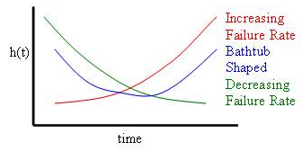

+++
title = "Survival Analysis"
date = 2019-10-22T00:00:00
lastmod = 2019-10-22T00:00:00
draft = false
reading_time = false
authors = ["Michael W. Brady"]
+++
A technique used to model anything with a finite duration (e.g., churn, retention, completion, life, reliability). Think of it as 'time to event' analysis

- Birth: the event that marks the beginning of the time period for observation
- Death: the event of interest, which marks the end of the observation period for the individual data point

**Survival analysis requires features that describe:** 

1. **A duration of time for an observation**
2. **A binary column regarding whether the event was observed (1 death event observed, 0 death event was not observed)**

## Censorship

Censored data refers to data in which the 'death' event for some observations occurs beyond the timeframe of the data (e.g., the person died eventually but not during the study). 

# Survival Functions

Start at 1, X-axis is 100% survival. By definition, only goes down over time. **Think of it as backward cumulative distribution function.** 

### Python Implementation

Create visual of survival function for entire dataset: 

    import lifelines
    
    kmf = lifelines.KaplanMeierFitter()
    kmf.fit(time, event_observed=event)
    kmf.survival_function_.plot()
    plt.title('Survival Function Leukemia Patients');
    print(f'Median Survival: {kmf.median_} months after treatment')

Create a visual to compare survival functions of two groups (divide based on binary feature):

    import lifelines
    
    kmf_w_contract = lifelines.KaplanMeierFitter()
    kmf_no_contract = lifelines.KaplanMeierFitter()
    
    ax = plt.subplot(111)
    
    w_contract = ( churn_data['On_Contract']== 1 )
    
    t = np.linspace(0, 70, 71)
    kmf_w_aid.fit(churn_data[w_contract]['tenure'], event_observed=churn_data[w_contract]['Death'], timeline=t, label="On Contract")
    ax = kmf_w_aid.plot(ax=ax)
    
    kmf_no_aid.fit(churn_data[~w_contract]['tenure'], event_observed=churn_data[~w_contract]['Death'], timeline=t, label="No Contract")
    ax = kmf_no_aid.plot(ax=ax)
    
    plt.ylim(0,1)
    plt.title("Churn Rate for Customers with a contract versus those without a contract\n");

# Hazards Model

Assumes the ratio of hazards (risk of failure) is constant over time across groups. **The hazard function represents the instantaneous likelihood of failure.** It can be treated as a PDF (probability density function), and with real-world data comes in three typical shapes.

